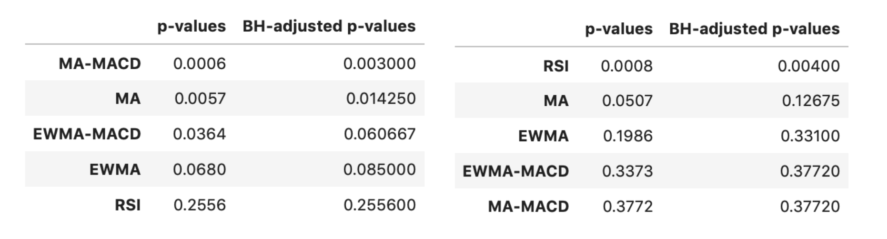

```{r setup, include=FALSE,echo=FALSE, message=FALSE}
suppressMessages(library(knitr))
knitr::opts_chunk$set(echo = TRUE)
```

\newpage
## Executive summary
The purpose of this project is to improve Seahorse’s stock market trading strategy using their proprietary oscillator data to maximise their annual portfolio returns. By using momentum indicators, we crafted different composite strategies and compared them against Seahorse’s benchmark strategy. We identified that the best strategies are:  

- “MA(10/13)_MACD(5,35,5)” for Buy/Long trade signals  
- “RSI(83/13)” for Sell/Short trade signals

## Background Introduction

#### Oscillator Primary Trade Signals and Filter Rules
Achieving higher returns is always what investors pursue in the stock market. For Seahorse, they use their proprietary oscillator data to help identify the direction of the stocks, so that they can make wiser decisions in the market. The yellow line below depicts time series data of the oscillator.

```{r, out.width = "280px", echo=FALSE,fig.align="center", fig.cap = "Primary oscillator data and trade signals"}
knitr::include_graphics("../proposal/presentation_notebooks/img/oscillator.png")
```
- Red vertical line: **Sell** signal corresponds to the point directly after a peak
- Blue vertical line: **Buy** signal corresponds to the point directly after a trough

These signals are defined as **primary signals** since they are unfiltered. However, using primary signals alone might lead to high risk trades. By applying filter rules, we can identify correct trading signals and achieve higher returns. Pairing the filters with the primary trade signals is called a **“composite trading strategy”**. Seahorse provided two basic filters, namely:

1. **Filter 1 (Trading with correct oscillator polarity)**: We only buy when the oscillator value is negative, and vice versa.

2. **Filter 2 (Absolute oscillator value < 7)**: When the magnitude of the oscillator value is above 7, it may indicate a period of market shock where there is high volatility during which trades are considered high risk.

Our **benchmark strategy** is defined to be the joint application of both Filter 1 and Filter 2 on the primary oscillator signals. 

#### Composite Trading Strategies

For this capstone, we are exploring the following momentum indicators to be used as additional filters: 

  - Moving Average (MA)
  - Exponential Weighted Moving Average (EWMA)
  - Relative Strength Index (RSI)
  - Moving Average Convergence Divergence (MACD)
  
By stacking the momentum indicator filters, we create different composite strategies. Table 1 is a summary of the composite strategy types with their filter components:

|Composite Strategy Types|Benchmark|MA|MA-MACD|EWMA|EWMA-MACD|RSI|
|------|----|----|---|---|---|---|---|---|
|Filter 1 + 2|Yes|Yes|Yes|Yes|Yes|Yes|
|Filter 3 Type||MA|MA|EWMA|EWMA|RSI|
|Filter 4 Type|||MACD||MACD|

\begin{center} Table 1: Composite Strategy Tables \end{center}
 
Each strategy type has its own set of parameters. Given that our data consist of 13 intraday intervals, we designed our strategy naming convention to capture that aspect. For example, a strategy label of “MA(28/13)_MACD(5,35,5)” implies that the composite strategy has a MA window of 28 intraday intervals, and a MACD parameter combination of 5 days, 35 days, 5 days. 
 
#### Annualised Return Metric Definition:

Seahorse provided a metric termed the annualised return, and its formulation is:

$$\left (\frac{Total\ \%\ Return\ of\ Filtered\ Trades\ in\ a\ Year}{Total\ Holding\ Time\ of\ Filtered\ Trades\ in\ a\ Year}\right ) \left (  \frac{252\ trading\ days\ *\ 13\ intraday\ intervals}{1\ year} \right )$$

This metric inherently calculates the percentage returns normalised by holding time intervals while converting it to a yearly basis (252 trading days in a year). By optimising to this value, the resultant optimised strategies are those that are “efficient” in terms of maximising gains for each unit of time invested in the market. For more details on its exact calculation, please refer to the Appendix.

## Research Question/Objectives

Seahorse Strategies wants to use their oscillator signals to generate profitable trades. Thus, our objective is to identify the best composite strategy that maximises average annualised returns for both __Buy__ and __Sell__ trade signals. 

## Data Science Methods 

During the initial phases of the project, the group debated about the application of “**train-test split**” for keeping some form of validation dataset. After much discussion, the group understood that the project focused on an optimisation objective for determining the best rule-based strategy. The implications of this is that no model training is required, and thus, there was no need for a train-test split for the dataset. All of the stocks data were used for strategy evaluation based on the annualised return metric.

Our group also utilised effective **visualisations**. For example, during our prototyping phase, some of us chose a two stage search technique by performing a lower resolution preliminary search before doing a more granular search over a reduced parameter space as shown in Fig 2. In our final data product, key visualisations were also incorporated for communicating our results as shown by the bar chart in Fig 3.

```{r, out.width = "240px", echo=FALSE,fig.align="center", fig.cap = "Preliminary Search Results for MA strategy evaluation"}

```

```{r, out.width = "440px", echo=FALSE,fig.align="center", fig.cap = "Bar-plot visualisations used in final data product"}
knitr::include_graphics("../summary_compilation/img/buy_meric_result.png")
```


A one-tailed **hypothesis test** framework was also used to evaluate if the average annualised return metric of different strategy types are significantly higher than the benchmark strategy (as shown by the following hypothesis test statements). To account for multiple hypothesis testing, the Benjamini Hochberg correction was adopted to control the false discovery rates. 

$$H_0:\mu_{alternative} - \mu_{benchmark} = 0$$
$$H_1:\mu_{alternative} - \mu_{benchmark} > 0$$

Even though the final recommendations are based on the average annualised return metric, it was also critical to provide the confidence level surrounding the average metric for the strategies. Thus, we performed **bootstrapping** on the average annualised return metric for each of the top strategy combinations against the benchmark strategy. 

```{r, out.width = "440px", echo=FALSE,fig.align="center", fig.cap = "Bootstrap sampling means histogram visualisations used in final data product"}
knitr::include_graphics("../bootstrap/img/buy_boot.png")
```

## Data Product

Our goal is for Seahorse to integrate some ideas from our backtesting research into their live trading strategy. Specifically, we want to provide them with momentum indicators with specific parameter values that help maximize their annualised risk-adjusted strategy return. 
 
The data product will comprise a mix of Jupyter notebooks (containing our documented analysis) and Python scripts (containing the custom functions for composite strategy evaluation). This will allow Seahorse to reproduce our findings, and implement their own backtests if needed. We believe this is beneficial as they can audit our code and manually assess whether any assumptions need to be changed. 
 
A potential downside of this approach is that Seahorse might not be able to manually dive into the code since they are not trained programmers. After discussion with them, we learned that they know individuals with strong programming skills who can help them walk through our code after the capstone is completed. Thus, our decision to provide the full code is justified as it provides the flexibility for Seahorse to experiment with backtesting new 
strategies in the future using our existing code. Furthermore, we chose not to use advanced machine learning for price prediction as financial time-series data is notoriously noisy with a low signal-to-noise ratio. Instead, we focused our efforts on finding a composite trading strategy that is easy for them to use in their live trading.


## Results and Concluding Recommendations 

Firstly, we were asked to find the best moving average window which can lead to maximized annual return. 

We extracted the trading signal (buy/sell) from the oscillator data. Using a MA window parameter, we calculate the MA value of the stock price. We will only keep a buy signal if the MA value at that point is higher than the previous MA value, and only keep the sell signal if the MA value at that point is lower than the previous MA value. 
Experimenting with various window sizes from 1/13 to 100/13, we observed that the best MA window for Buy/Long and Sell/Short signals are different:

  - 28/13 days is the optimal period for Buy trade signals with average annualised return 26.85%.

  - 13/13 days is the best moving average period for Sell trade signals with annualised return -0.0439%. 
  
Expanding the search over other composite strategy types mentioned in Table 1, we found that: 

- For Buy trade signals, the best strategy type is the combination of MA period with 10/13 days and MACD(5,35,5) with an average annualised return 42.25% as shown in Fig 5.

```{r, out.width = "400px", echo=FALSE,fig.align="center", fig.cap = "Buy trade results"}
knitr::include_graphics("../summary_compilation/img/buy_meric_result.png")
```
 
- For Sell trade signals, the RSI strategy type of window 83/13 is the best strategy to filter out trade signals with an average annualised return 73.75% as shown in Fig 6.

```{r, out.width = "400px", echo=FALSE,fig.align="center", fig.cap = "Sell trade results"}
knitr::include_graphics("../summary_compilation/img/sell_metric_result.png")
```

We applied the bootstrapping method with hypothesis testing framework to check the statistical significance of our result. This was done by comparing the average annualised return of the best from each strategy type against the benchmark (Filter1+Filter2). 

```{r, out.width = "400px", echo=FALSE,fig.align="center", fig.cap = "p-value table of buy-only (left) and sell-only (right) strategy"}

```

As shown in figure 7, based on the hypothesis testing with BH correction at 5% significance, we conclude that __both the "MA+MACD" strategy for Buy signals and the "RSI" strategy for Sell signals have statistically significantly higher average annualised returns than the benchmark group.__
 
## Limitations and Future Directions 

Due to the limit of time and computing power, we were not able to search over all combinations of indicators. We might miss some better combination of filters and combination of windows of the indicators. Additionally, a lot of time was spent finding the right optimization metric, so it would be more time-efficient if our partner could provide us with a desired metric of optimization from the start.

As a disclaimer to our proposed suggestions, it is important to consider the limitations of this analysis. During the process of data-mining the ideal set of parameters, we searched over thousands of different combinations. A larger optimization search space will increase chances of choosing a false positive investment strategy. Therefore, any proposed strategy should be carefully scrutinized and tested on a small amount of capital before scaling to the broader portfolio. 

For future directions, we can develop a machine learning model that makes decisions on trade action based on the performance of momentum indicators. Also, an unsupervised machine learning model can be made to classify groups of stocks so that we can give customized filters to different groups of stock to improve profitability. Moreover, including more data for other stocks will make our result more generalisable. 
\newpage
## Appendix 

#### MACD and RSI
The MACD momentum indicator has 3 parameters which makes it hard to optimise over. During our prototyping, the group decided to stick to 3 common MACD combinations (fast period, slow period, signal period) that are used in the industry:

- 12 days, 26 days, 9 days
- 8 days, 17 days, 9 days
- 5 days, 35 days, 5 days

The RSI indicator involves extra parameters in terms of upper bound and lower bound that are used to define the oversold and overbought regions for stocks. The group decided to stick with the following:

- Upper bound = 60
- Lower bound = 40
 
#### Annualised Metric Definition:

The annualised return is calculated based on the following: 

$$\left (\frac{Total\ \%\ Return\ of\ Filtered\ Trades\ in\ a\ Year}{Total\ Holding\ Time\ of\ Filtered\ Trades\ in\ a\ Year}\right ) \left (  \frac{252\ trading\ days\ *\ 13\ intraday\ intervals}{1\ year} \right )$$

$$Total\ \%\ Return\ of\ Filtered\ Trades\ in\ a\ Year = \sum_{i=1}^{Filtered\ Trades} \%\ return\ of\ trade\ signal\ i$$


$$Total\ Holding\ Time\ of\ Filtered\ Trades\ in\ a\ Year = \sum_{i=1}^{Filtered\ Trades} Intraday\ Interval\ Holding\ time\ for\ trade\ signal\ i$$

For a given strategy combination, we took the following detailed approach:

  - We first calculated it on a **per stock per year basis**. This gave us 46 stocks * 21 years = 966 values for each strategy combination.
  - Subsequently, we took the **average metric values across all stocks** (assuming an equal stock basket weightage) for 21 years.
  - Lastly, we calculated the **average metric values across all 21 years**. This final value is the basis for our ranking and optimisation across the different strategy combinations.


