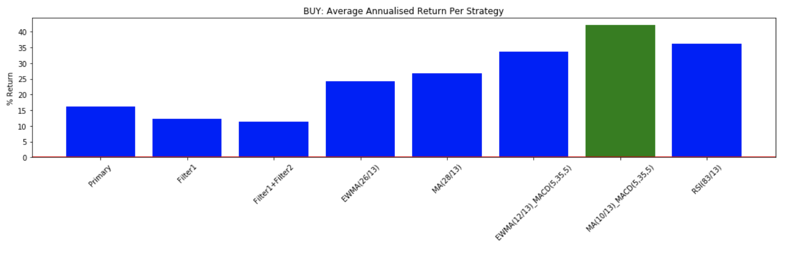
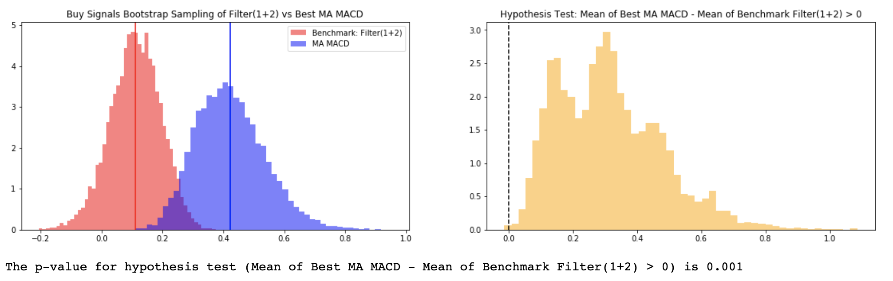
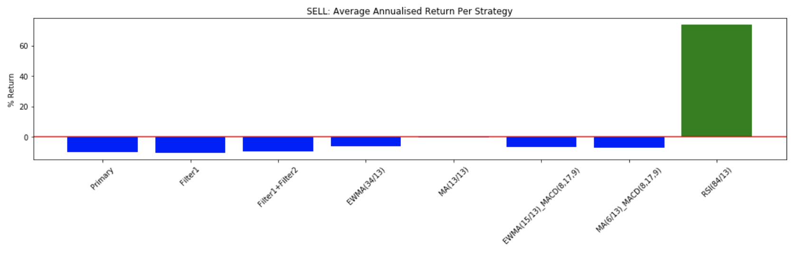
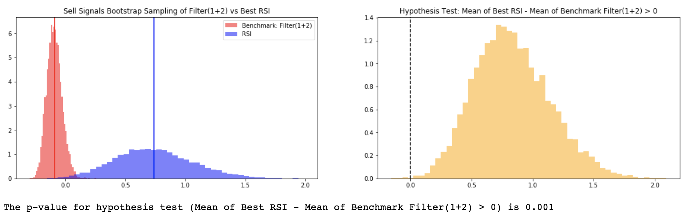

# DSCI_591-Seahorse
This repository is the result of a capstone project between UBC MDS and Seahorse, held in May and June 2020.

### Authors: 

- Sam Chepal
- Kenneth Foo
- Huayue Lu
- Wenjiao Zou

### Introduction:

Achieving higher return is always what investors pursue in the stock market. For Seahorse, our capstone partner, they used their proprietary oscillator data to help identify the direction of stocks to make wiser trading decisions in the market.

The purpose of this capstone project is to improve Seahorse's existing stock market trading strategy using their proprietary oscillator data by maximizing their annual portfolio returns. We have given brief introduction of the background, identifying research questions and setting goals and directions of this project in the [final report](https://github.ubc.ca/MDS-2019-20/DSCI_591-Seahorse/blob/master/Final_report/Final_report.pdf). 


### Objective:

Seahorse Strategies wants to use their oscillator signals to generate profitable trades. To help them achieve that, we made the following objective:  

__Optimisation Objective__: Identify the best composite strategy that maximizes average annualised returns. 


To achieve this goal, we have explored different momentum indicators, as filters, to identify correct trade signals thus achieving higher returns. By pairing filters with the trade signals, we have created several composite trading strategies, including:

- Moving Average Trend Alignment - MA
- Exponentially Weighted Moving Average - EWMA
- Relative Strength Indicator - RSI
- Moving Average + Moving Average Convergence and Civergence - MA + MACD
- Exponentially Weighted Moving Average + Moving Average Convergence and Divergence - EWMA + MACD

For each filter, we have created functions for selecting signals, getting metric returns, picking out the top strategy and calculating statistics for the top strategies. We have also provided a walkthrough of the optimisation process for each strategy. You can refer to [strategy_calculation file](https://github.ubc.ca/MDS-2019-20/DSCI_591-Seahorse/tree/master/strategy_calculation) for more details. Finally, we compiled the results together and made a summary, and you can see visualised results in [summary compilation file](https://github.ubc.ca/MDS-2019-20/DSCI_591-Seahorse/blob/master/summary_compilation/plotting_analysis.ipynb).

For each strategy, we have a yearly breakdown of the annualised return metric (21 values based on 21 years). To check the statistical significance level of our results, we performed bootstrapping on the different strategies. You can see the bootstrapping process and results in the [bootstrap file](https://github.ubc.ca/MDS-2019-20/DSCI_591-Seahorse/blob/master/bootstrap/bootstrapping.ipynb).


### Highlights

Below are some highlights based on our summary compilation:


For **BUY signals**, the average annualised return of each strategy is:



The hypothesis testing of the top buy strategy is shown below:




For **SELL signals**, the average annualised return of each strategy is:



The hypothesis testing of the top sell strategy is shown below:




Thus, we recommend:


### Dependencies

  - Python 3.6.9 and Python packages:
    
      - numpy \>= 1.18.1
      - pandas \>= 0.24.2
      - matplotlib \>=3.1.0
      - TA-Lib \>=0.4.18   
      - tqdm \>=4.32.1
      
  - R version 3.6.1 and R packages:
   
      - knitr \>= 1.27.2

### Installation of dependencies

Run the following command in terminal to install all of the required packages. 

```
pip install -r requirements.txt
```
*Note: The `TA-Lib` library installation can be particularly tricky given the large number of dependenices for this package. For that reason, this library must be separately installed as shown [here](https://mrjbq7.github.io/ta-lib/install.html).


### File Structure
```bash
├── data
|   ├── 2020
|   ├── | adsk20years.txt....
├── strategy_calculation
|   ├── MA
|   ├── | calculation_ma.ipynb
|   ├── | functions.py
|   ├── MA-MACD
|   ├── | MA-MACD_optimisation.ipynb
|   ├── | ma_macd_calculation.py
|   ├── EWMA
|   ├── | EWMA_walkthrough.ipynb
|   ├── | buy_annualized_ewma.csv
|   ├── | sell_annualized_ewma.csv
|   ├── | ewma_calculation.py
|   ├── EWMA-MACD
|   ├── | EWMA-MACD_optimisation.ipynb	
|   ├── | ewma_macd_calculation.py
|   ├── RSI
|   ├── | RSI_optimisation.ipynb
|   ├── | rsi_calculation.py
|   ├── Primary
|   ├── | calculation_primary_filter.ipynb
|   ├── | filtered_signal.py
|   ├── Output_strategy_statistics
|   ├── | ewma_macd_buy.csv
|   ├── | ewma_macd_sell.csv
|   ├── | ewma_top_buy.csv
|   ├── | ewma_top_sell.csv	
|   ├── | ma_macd_buy.csv	
|   ├── | ma_macd_sell.csv	
|   ├── | result_ma_buy.csv	
|   ├── | result_ma_sell.csv
|   ├── | result_primary_buy.csv
|   ├── | result_primary_sell.csv
|   ├── | rsi_top_buy.csv
|   ├── | rsi_top_sell.csv
├── strategy_compilation
|   ├── img 
|   ├── | buy_metric_result.png
|   ├── | sell_metric_result.png
|   ├── | summary.png	
|   ├── plotting_analysis.ipynb
├── bootstrap
|   ├── buy 
|   ├── | ewma_macd_top_buy.csv
|   ├── | ewma_top_buy.csv
|   ├── | ma_top_buy.csv
|   ├── | ma_macd_top_buy.csv
|   ├── | rsi_top_buy.csv
|   ├── | f2_buy.csv
|   ├── | unused
|   ├── |   ├── f1_buy.csv
|   ├── |   ├── primary_buy.csv
|   ├── img 
|   ├── | sell_boot.png
|   ├── | buy_boot.png	
|   ├── | bootstrap_demo.png
|   ├── sell 
|   ├── | ewma_macd_top_sell.csv
|   ├── | ewma_top_sell.csv
|   ├── | ma_top_sell.csv
|   ├── | ma_macd_top_sell.csv
|   ├── | rsi_top_sell.csv
|   ├── | f2_sell.csv
|   ├── | unused
|   ├── |   ├── f1_sell.csv
|   ├── |   ├── primary_top_sell.csv
|   ├── bootstrapping.ipynb
├── Final_report
|   ├── img
|   ├── | boot_table.png
|   ├── | scatter.png
|   ├── Final_report.Rmd
|   ├── Final_report.pdf
├── requirements.txt
├── README.md
├── team_contract.md
└── .gitignore
```
