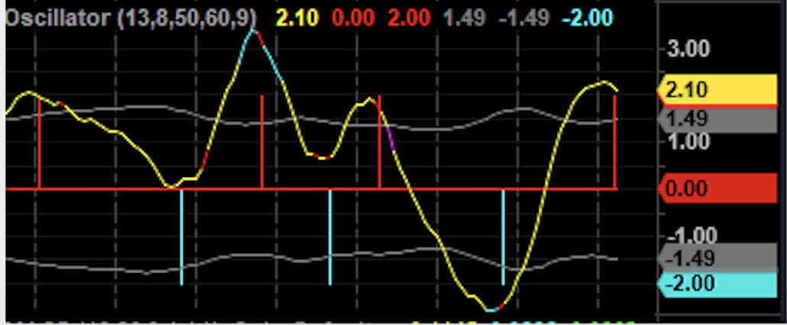
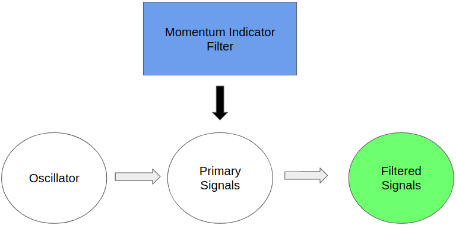
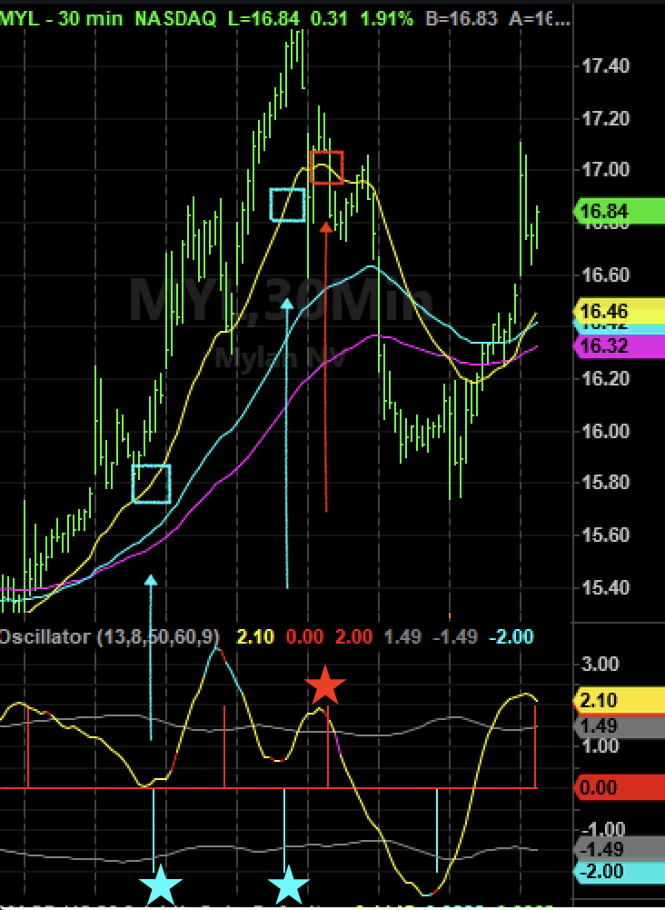
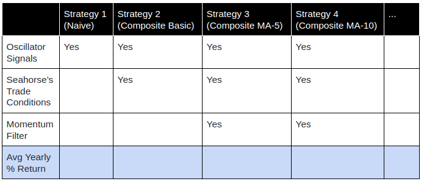
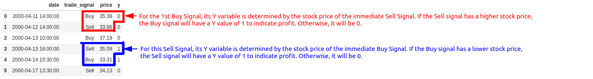

```{r setup, include=FALSE,echo=FALSE, message=FALSE}
suppressMessages(library(knitr))
knitr::opts_chunk$set(echo = TRUE)
```
\newpage
## Executive Summary
The purpose of this capstone project is to improve Seahorse's stock market trading strategy using their proprietary oscillator data to improve their annual portfolio returns. First, we will optimise the appropriate momentum indicator filter to create a composite strategy with the highest average annual returns. Secondly, we want to create a model that predicts the profitability of oscillator trade signals to improve their decision making process.

## Background

#### Oscillator Primary Trade Signals

Seahorse uses a proprietary trading algorithm to generate their oscillator data. The oscillator helps identify the direction of a stock, so that they can make wiser trading decisions in the stock market. The yellow line in the following graph illustrates time series data of the oscillator.

```{r, out.width = "240px", echo=FALSE,fig.align="center", fig.cap = "Primary oscillator data and trade signals"}

```
- Red vertical line: **Sell** signal corresponds to the point directly after a peak in the oscillator
- Blue vertical line: **Buy** signal corresponds to the point directly after a trough in the oscillator

These signals are considered **primary signals** as they are unfiltered. Using these primary signals is called the **"naive"** trading strategy.

#### Evaluation metrics

We calculate the return of each trade by **percentage change** in the stock price. Suppose we enter a trade when the price is $p_0$, and exit when the price is $p_1$, then the return $r$ is:

- Long trade (Buying first then Selling): $r = \frac{p_1-p_0}{p_0}$
- Short trade (Selling first then Buying): $r = \frac{p_0-p_1}{p_0}$

We evaluate each strategy by its yearly portfolio return. It is calculated by compounding the returns of making *n* trades in a year:

$$R = (1+r_0)*(1+r_1)*(1+r_2)*...*(1+r_n) - 1$$
\newpage

#### Filter Rules and Filtered Trade Signals

```{r, out.width = "240px", echo=FALSE,fig.align="center", fig.cap = "Primary oscillator data and trade signals"}

```

According to Seahorse Strategies, the oscillator alone does not lead to satisfying yearly returns. A momentum indicator serves as a filter that can be used to determine the direction or trend of a stock. Using momentum indicators, we can identify correct trade signals to achieve higher returns. For the capstone, we want to optimise one of the filters termed "moving average (MA-X) trend alignment” where MA refers to the stock price moving average and X is the window width. By pairing filters with the trade signals, the strategy is called a **"composite"** trading strategy. 

```{r, out.width = "180px", echo=FALSE,fig.align="center", fig.cap = "Filtered oscillator trade signals with MA-X rule"}

```

With that filter rule, we should derive **filtered trade signals** (illustrated in the graph above):

- **Sell** signals with a dropping MA-X as represented by the Red stars
- **Buy** signals with a rising MA-X as represented by the Blue stars

Besides the MA-X filter, we are also interested in identifying other momentum indicators that can be paired with the oscillator data to improve yearly portfolio return.

## Research Questions

Seahorse Strategies wants to use their oscillator signals to generate profitable trades. To help them achieve that, we want to answer the following research questions:  

1. __Optimisation Objective__: Which momentum indicator is most appropriate to filter out low quality trading signals to maximise average annual returns?

2. __Predictive Objective__: Using a model, can we predict if the primary oscillator trade signals will be profitable?

## Plan for Optimisation Objective:

The first key objective is to develop an optimal momentum indicator filter which will maximize the yearly average returns. Our group will approach this optimisation through a series of several steps as outlined below:

**<ins>Step 1: Developing a Baseline</ins>**: We will begin by calculating the baseline performance of the naive trading strategy using the average yearly financial returns over twenty years. 

**<ins>Step 2: Add Real-World Trade Conditions Filter</ins>**: After we develop a baseline model from the previous step, we will incrementally include several conditions suggested by Seahorse Strategies based on their domain experience in financial markets (i.e., never trade "Buy" if the oscillator value is above zero). 

**<ins>Step 3: Add Momentum Indicator Filters and Optimise</ins>**: In addition to the rules we set in step two, Seahorse also suggested experimenting with several momentum indicator filters (i.e., simple moving average, exponential weighted moving average, relative strength index, etc) that can improve their average annual returns.

We can determine how the incremental addition of these filters impact the strategy's returns relative to the baseline return calculated in step one. Our objective is to find an optimised composite strategy which provides the highest average yearly financial return over the past twenty years.

```{r, out.height="150px", echo=FALSE,fig.align="center", fig.cap = "Strategies Table"}

```

## Plan for Predictive Objective:

Manually employing composite strategies with multiple filters may result in delayed decision making. This can be highly detrimental in the stock market which is highly dynamic. Thus, after obtaining the best filter in the optimisation objective, we want to equip Seahorse with an automated tool that can expedite their decision making process.

Based on our research of the finance industry, we understand that predicting future stock prices is notoriously difficult. At the same time, our purpose is to reduce the time needed for making trade decisions. Thus, we are proposing a predictive model that provides a binary result of trade profitability (profit or loss) for each primary trade signal.

**<ins>Train test split:</ins>** With data from 50 stocks, we will randomly choose 40 of them as our training set and 10 of them as test set. We want the model to generalise to unseen stocks, and thus the test data should comprise of stock data that the model was not exposed to.
 
**<ins>Data Preprocessing:</ins>** Our raw data only contains date, price and oscillator values. Given that our objective is to predict the profitability of trade signals, we will need to construct feature-engineered predictors and response variables based on available data.

a) All trade signals will be assigned by extracting all peaks and troughs from oscillator data with the appropriate "buy/sell" labels.
b) We will create predictors (X) that can include feature engineered variables of stock price attributes (i.e., the slope of moving average curves, etc).
c) The trade profitability label (Y) of each signal will be created based on the stock price of the immediate trade signal. Refer to Figure 5 for an example.

```{r, out.width = "500px", echo=FALSE,fig.align="center", fig.cap = "Response Variable (Y) Labelling for Predictive Objective"}

```  

**<ins>Model Fitting:</ins>** Various models such as random forest, logistic regression and neural networks will be explored while considering factors such as feature importances and model complexities. Rather than solely tuning the model based on accuracy, we will also consider model precision. While high accuracy improves the quality of our predictive model by maximizing $\frac{Number\ of\ Correctly\ Labelled\ Signals}{Number\ of\ Signals }$, high precision can reduce the chance of executing losing trades by maximizing $\frac{Number\ of\ True\ Profitable\ Signals}{Number\ of\ Predicted\ Profitable\ Signals }$. Hyperparameter tuning techniques will be employed to avoid overfitting and underfitting issues.

## Milestones:
By May 23rd, our team aims to create a preliminary composite strategy that uses a filter derived from a 5 day moving average of the stock price. Based on that, we will explore other moving average window periods. Additionally, we will also try out using other types of momentum indicators such as relative strength index or moving average convergence divergence. 

By June 5th, our team aims to create a preliminary predictive model using logistic regression. Subsequently, we will explore other model algorithms such as random forests or neural networks with proper tuning. If time permits, we will explore predicting the amount of profits for each trade signal by treating the response variable as a continuous one.

## Project Success and Deliverables:
We want to recommend the best composite strategy based on annual portfolio percentage returns. Beyond finding the best filter, we want to create a model with feature engineering of stock attributes to predict if the primary oscillator trade signals will be profitable or not. All reproducible scripts for analysis and modelling will be handed over to Seahorse Strategies, with a potential for a dashboard product that requires integration of the proprietary oscillator data.

